# Module 2 - Session 7: Managing Data with No-Code Databases

Welcome back, data-driven innovators!

Throughout our journey, we've created websites, mobile apps, and automated workflows. Now it's time to explore the foundation that makes all these tools truly powerful: your data! Think of data as the lifeblood of your digital applications—it's what transforms static interfaces into dynamic, personalized experiences that grow and adapt with your needs.

## Learning Objectives

In this session, you will learn to:
- Define No-Code databases and understand their crucial role in app functionality
- Describe the key features of Airtable, Firebase, and Google Sheets for data handling
- Compare No-Code database tools to choose the right solution for your needs
- Outline the steps to design and seamlessly link a database with a No-Code app

Let's continue with Henry from "The Sweet Spot Bakery" and Sarah, our innovative middle school English teacher, as they discover how proper data management can transform their digital solutions from simple tools into intelligent systems!


## 7.1 Introduction to No-Code Databases

### 7.1.1 Database Concepts in No-Code Environments

Before diving into specific tools, let's demystify what databases actually are in the context of no-code development.

A database is simply an organized collection of information that can be easily accessed, managed, and updated. In the no-code world, databases become the central nervous system of your applications:

- **Data Storage**: A secure, organized place to keep all your information
- **Data Retrieval**: Quick access to specific information when needed
- **Data Relationships**: Connections between different pieces of information
- **Data Integrity**: Ensuring information remains accurate and consistent
- **Data Scalability**: Growing alongside your application's needs

Henry reflects: "I used to think databases were only for big companies with IT departments. Now I realize that even my simple customer list and inventory tracking are types of databases—they just needed better organization!"

Sarah adds: "Every gradebook, student roster, and assignment tracker I use is essentially a database. The difference is whether I'm managing it manually or letting technology help me connect and automate everything."

> **PRO-TIP:**
> Don't be intimidated by database terminology. If you can organize information in a filing cabinet or spreadsheet, you already understand the basic concepts of database organization.

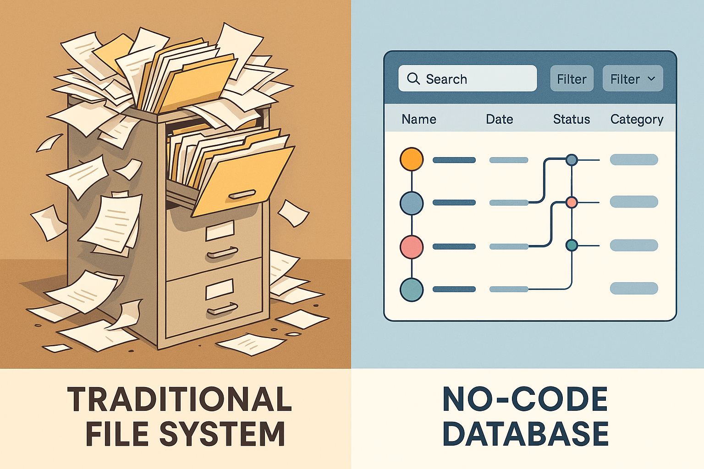

### 7.1.2 Key Elements in No-Code Database Platforms

No-code database platforms share several fundamental concepts that make them accessible to non-technical users:

**Tables (or Collections)**: Think of these as different filing cabinets for different types of information
- Henry's example: Customers table, Orders table, Products table
- Sarah's example: Students table, Assignments table, Grades table

**Records (or Documents)**: Individual entries within each table
- Henry's example: Each customer is one record in the Customers table
- Sarah's example: Each student is one record in the Students table

**Fields (or Properties)**: Specific pieces of information about each record
- Henry's example: Customer Name, Email, Phone, Preferred Contact Method
- Sarah's example: Student Name, Grade Level, Parent Contact, Reading Level

**Relationships**: Connections between information in different tables
- Henry's example: Linking customer records to their order history
- Sarah's example: Connecting students to their assignment submissions and grades

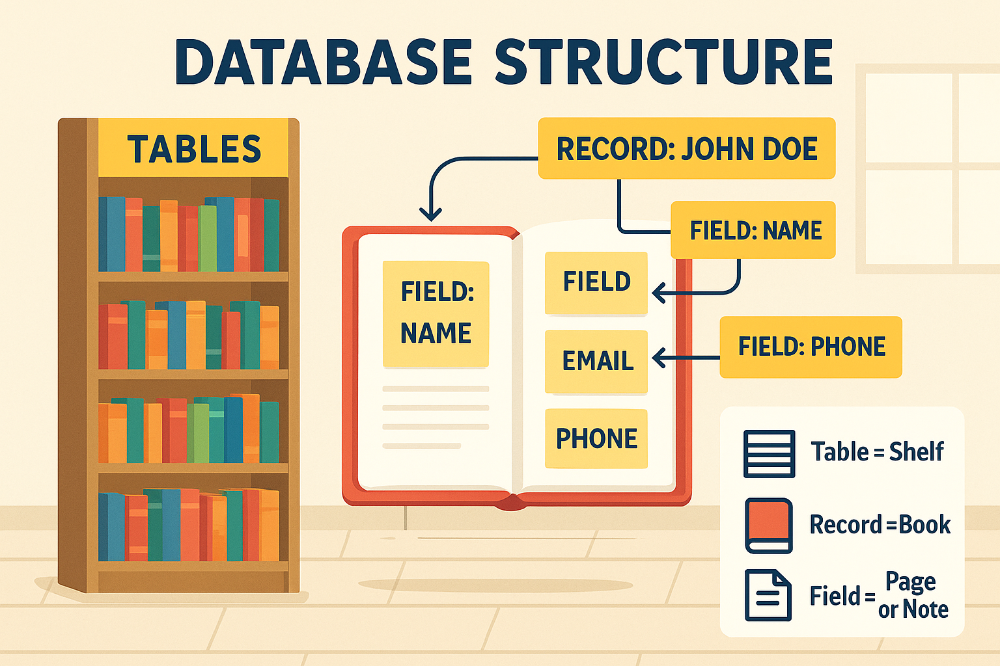

### 7.1.3 Structured and Unstructured Data in App Development

Understanding different types of data helps you choose the right storage approach:

**Structured Data**: Information that fits neatly into predefined categories
- Examples: Names, dates, prices, yes/no answers, dropdown selections
- Advantages: Easy to search, sort, and analyze
- Best stored in: Traditional database tables with clear columns

**Unstructured Data**: Information that doesn't fit standard categories
- Examples: Text descriptions, images, audio files, complex documents
- Advantages: Flexible, can capture rich information
- Best stored in: Document-based or flexible schema databases

Henry's Mixed Data Types:
- Structured: Product names, prices, inventory quantities, order dates
- Unstructured: Customer feedback comments, product photos, custom cake design sketches

Sarah's Mixed Data Types:
- Structured: Student names, grades, assignment due dates, completion status
- Unstructured: Essay submissions, creative writing projects, discussion forum posts

> **PRO-TIP:**
> Most real-world applications need both structured and unstructured data. Choose database tools that can handle both types effectively, or use complementary tools that work well together.

### 7.1.4 Role of Data in No-Code Applications

#### 7.1.4.1 Flow of Data Within No-Code Apps

Data in no-code applications follows predictable patterns that create user experiences:

1. **Data Input**: Information enters through forms, imports, or API connections
2. **Data Processing**: Information is validated, formatted, and organized
3. **Data Storage**: Information is saved in the appropriate database structure
4. **Data Retrieval**: Information is accessed when needed for display or operations
5. **Data Output**: Information is presented to users or sent to other systems

Henry's Bakery Data Flow:
1. Customer places order on website (Input)
2. Order details are validated and formatted (Processing)
3. Order saved to database, inventory updated (Storage)
4. Staff access order details for production (Retrieval)
5. Confirmation email sent, receipt generated (Output)

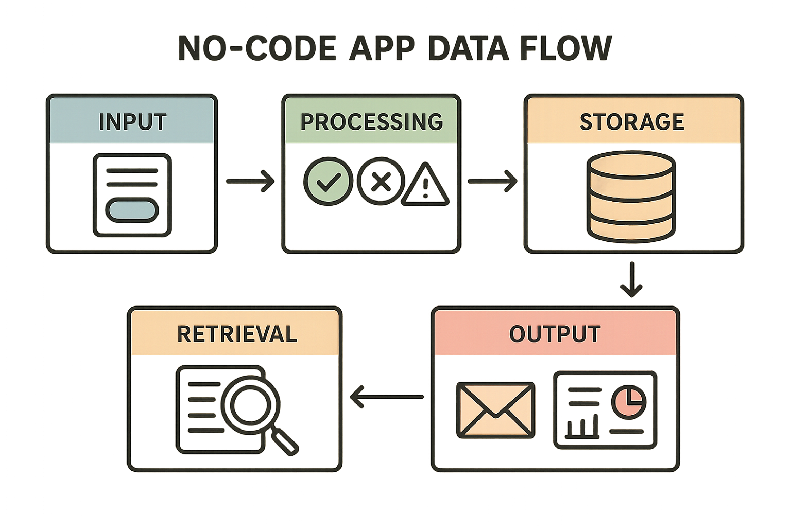

#### 7.1.4.2 No-Code Platform Data Usage for Functionality

Different no-code platforms use database information to power specific features:

**Dynamic Content**: Pages that change based on stored information
- Henry's product catalog that updates automatically when inventory changes
- Sarah's reading lists that adapt based on student reading levels

**User Personalization**: Experiences tailored to individual users
- Henry's customer portal showing order history and preferences
- Sarah's student dashboard displaying personalized assignment recommendations

**Automation Triggers**: Actions that occur automatically based on data conditions
- Henry's reorder alerts when inventory falls below threshold levels
- Sarah's parent notifications when students miss assignment deadlines

**Reporting and Analytics**: Insights generated from collected data
- Henry's monthly sales reports showing best-selling products
- Sarah's progress tracking showing individual and class performance trends

#### 7.1.4.3 Common Use Cases (such as user data, content management, and automation)

No-code databases excel in several common scenarios:

**User Management**:
- Profile information
- Preferences and settings
- Activity history
- Permission levels

**Content Management**:
- Article or blog post storage
- Product catalogs
- Resource libraries
- Media file organization

**Customer Relationship Management (CRM)**:
- Contact information
- Communication history
- Sales pipeline tracking
- Customer support tickets

**Project and Task Management**:
- Project timelines
- Task assignments
- Progress tracking
- Resource allocation

Sarah explains: "My classroom database handles all these use cases simultaneously. It manages student information (user management), stores lesson plans and resources (content management), tracks parent communication (CRM), and organizes assignment workflows (project management)."

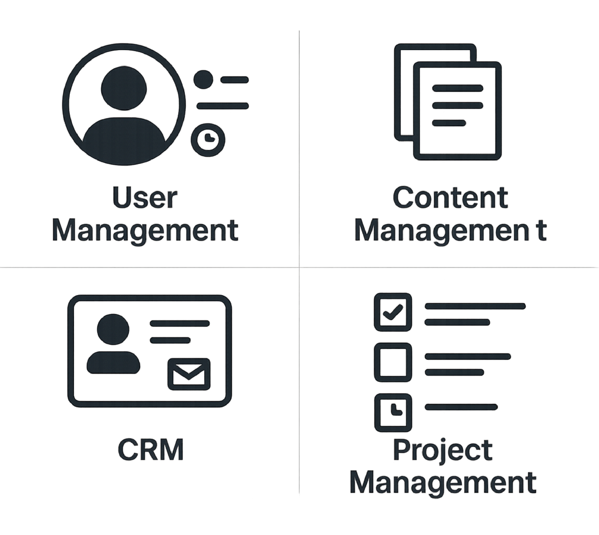

### 7.1.5 Types of No-Code Databases

#### 7.1.5.1 Categorizing Database Types: Spreadsheet-Based, Document-Based, and Relational

Understanding the three main types helps you choose the right approach:

**Spreadsheet-Based Databases**:
- Structure: Familiar rows and columns format
- Examples: Google Sheets, Excel Online, Smartsheet
- Best for: Simple data, quick setup, teams comfortable with spreadsheets
- Limitations: Complex relationships, scalability challenges

**Document-Based Databases**:
- Structure: Flexible documents that can contain various data types
- Examples: Firebase Firestore, MongoDB Atlas, Notion databases
- Best for: Complex, varying data structures, rapid development
- Limitations: Can become complex quickly, requires more planning

**Relational Databases**:
- Structure: Multiple connected tables with defined relationships
- Examples: Airtable, Microsoft Dataverse, Supabase
- Best for: Complex data relationships, business applications, long-term growth
- Limitations: Steeper learning curve, requires more initial setup

Henry's Evolution: "I started with a Google Sheet for customer information. As my bakery grew, I moved to Airtable to connect customers, orders, and products properly. Now I can see complete customer histories and track product popularity across different customer segments."

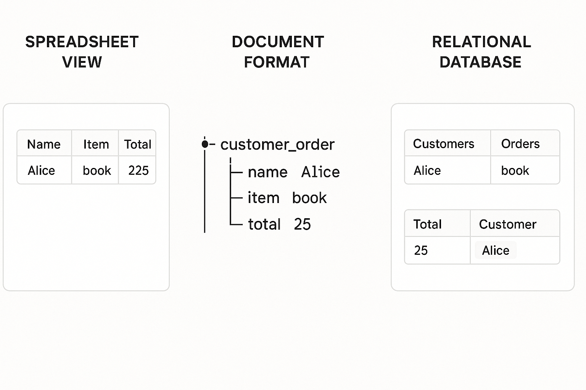

**Data Types and Structures**

Each database type handles different kinds of information:

- **Text**: Names, descriptions, categories
- **Numbers**: Prices, quantities, ratings, calculations
- **Dates**: Order dates, deadlines, timestamps
- **Boolean**: Yes/No, True/False, checkbox values
- **Links**: Connections to other records or external URLs
- **Attachments**: Images, documents, media files
- **Formulas**: Calculated fields based on other data

**Relationships and Linked Records**

Modern no-code databases excel at connecting related information:

- **One-to-Many**: One customer can have many orders
- **Many-to-Many**: Many students can take many classes
- **One-to-One**: Each order has one shipping address

**Flat vs. Relational Models**

- **Flat Model**: All information in one table (like a single spreadsheet)
- **Relational Model**: Information spread across multiple connected tables

**Normalization Basics**

Normalization reduces data redundancy:
- Instead of repeating customer information in every order record
- Store customer information once and link orders to it

#### 7.1.5.2 When to Use Airtable, Firebase, or Google Sheets

Each platform has strengths for different scenarios:

**Choose Google Sheets When**:
- You need quick setup and familiar interface
- Data is relatively simple and flat
- Team is already comfortable with spreadsheets
- Budget is a primary concern (free tier is generous)
- Integration with other Google Workspace tools is important

**Choose Airtable When**:
- You need to connect multiple types of related information
- Data relationships are important for your use case
- You want database power with spreadsheet familiarity
- Visual organization and multiple views are valuable
- You're building a business application that will grow

**Choose Firebase When**:
- You need real-time data synchronization across users
- Building mobile apps or web applications
- User authentication and security are critical
- You anticipate high traffic or usage
- You need flexible, document-based data storage

Sarah's Tool Selection: "I use Google Sheets for simple tracking like attendance and basic grades. For my complex reading program with linked books, students, and progress tracking, I use Airtable. For my classroom collaboration app where students need real-time updates, I use Firebase."

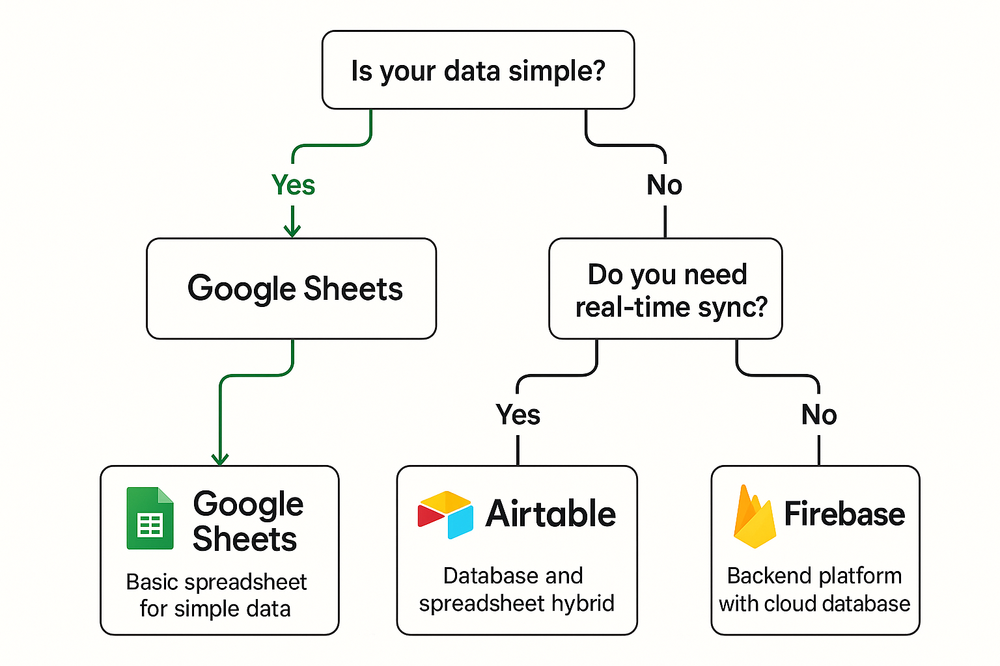

#### 7.1.5.3 Hosted Vs Self-managed No-Code Data Solutions

Understanding hosting options affects your long-term strategy:

**Hosted Solutions** (Google Sheets, Airtable, Firebase):
- Advantages: No technical maintenance, automatic updates, built-in security
- Considerations: Monthly costs as you scale, less control over data location
- Best for: Most no-code users, focus on building rather than maintaining

**Self-managed Solutions** (Self-hosted databases, local files):
- Advantages: Complete control, potential cost savings, custom configurations
- Considerations: Requires technical knowledge, ongoing maintenance responsibility
- Best for: Advanced users with specific control or compliance requirements

Henry notes: "As a small business owner, hosted solutions are perfect. I'd rather pay a monthly fee and focus on baking than worry about server maintenance and security updates."

✨ **PLAYGROUND TASK #1: ASSESS YOUR DATA NEEDS**

Instructions:
1. Think about a project or process you manage regularly (personal or professional)
2. List all the different types of information involved (people, items, dates, etc.)
3. Identify relationships between these types (e.g., people have multiple items, items have due dates)
4. Based on what you've learned, which database type (spreadsheet, document, or relational) seems most suitable?
5. Which specific tool (Google Sheets, Airtable, or Firebase) would you choose and why?

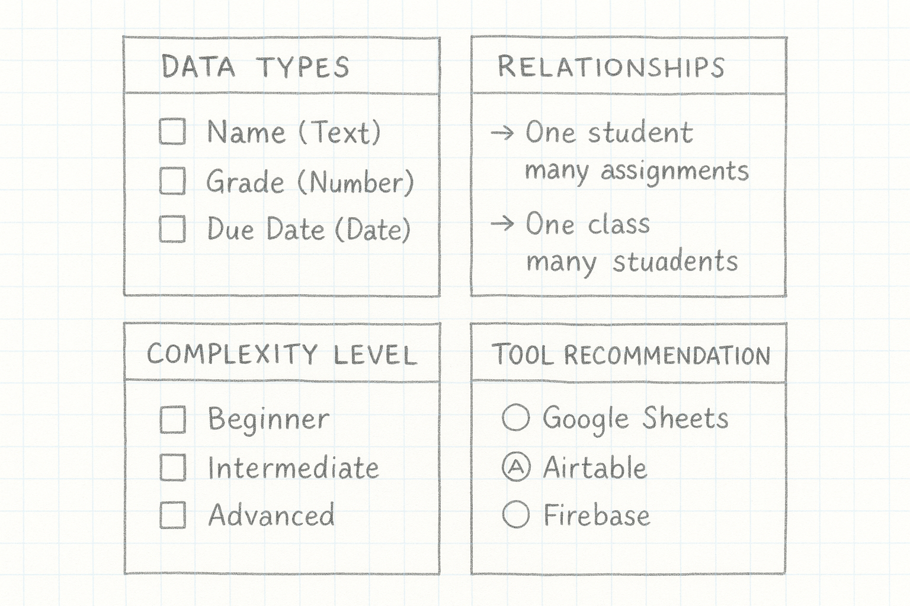

## 7.2 Key Features of Airtable, Firebase, and Google Sheets

### 7.2.1 Highlighting Airtable as a Relational Database Tool

#### 7.2.1.1 Airtable's Interface and Spreadsheet-Style Layout

Airtable brilliantly combines the familiarity of spreadsheets with the power of relational databases:

**Grid View**: The familiar spreadsheet interface that most users recognize
- Rows represent individual records
- Columns represent different fields
- Cells contain the actual data
- Filtering and sorting work intuitively

**Field Types**: Rich data types that go beyond simple text and numbers
- Single line text, Long text, Attachments
- Single select, Multiple select, Checkboxes
- Date, Number, Currency, Percent
- Formula, Lookup, Rollup
- Linked records (the key to relational power)

**Multiple Views**: Different ways to visualize the same data
- Grid view for spreadsheet-like work
- Calendar view for date-based information
- Gallery view for image-rich content
- Kanban view for project management workflows

Henry describes his experience: "Airtable looks like Excel at first glance, which made me comfortable. But when I started linking my customers to their orders and products, I realized I was building something much more powerful than any spreadsheet I'd used before."

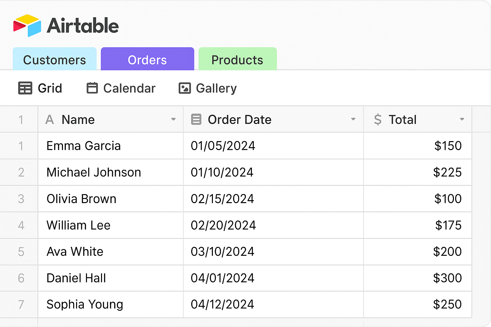
#### 7.2.1.2 Linked Records and Relational Data Features

The real power of Airtable lies in connecting related information:

**Linked Record Fields**: Create connections between records in different tables
- Link customers to their orders
- Link orders to specific products
- Link products to suppliers

**Lookup Fields**: Display information from linked records
- Show customer name on order records
- Display product details in order summaries

**Rollup Fields**: Perform calculations across linked records
- Calculate total order value per customer
- Count number of orders per month
- Average order size by customer type

**Two-way Linking**: Relationships automatically work in both directions
- From customer record, see all their orders
- From order record, see customer details

Sarah's Implementation: "I link students to their assignments, assignments to reading levels, and reading levels to recommended books. This lets me see each student's complete learning journey and automatically suggest appropriate next steps."

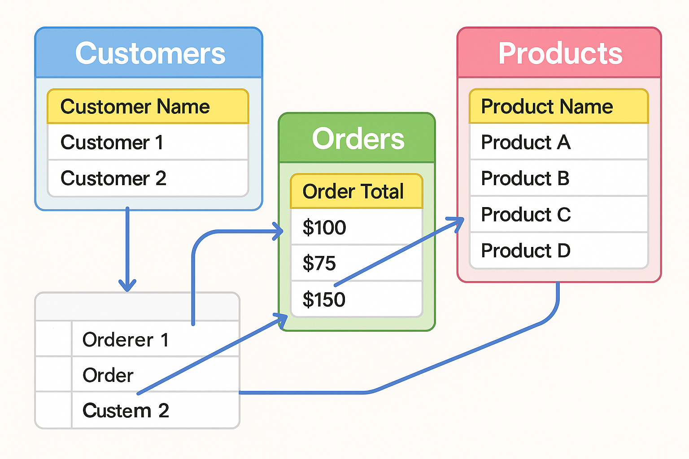

#### 7.2.1.3 Use Cases (such as content planning and CRM)

Airtable excels in scenarios requiring organized, connected information:

**Content Planning and Management**:
- Blog posts linked to authors, categories, and publication schedules
- Social media content connected to campaigns and performance metrics
- Resource libraries with tagging and categorization systems

**Customer Relationship Management (CRM)**:
- Contact information with communication history
- Sales pipeline tracking with deal stages and probabilities
- Support ticket management with priority and resolution tracking

**Project Management**:
- Tasks linked to projects, team members, and deadlines
- Resource allocation and capacity planning
- Progress tracking with automated status updates

**Inventory and Asset Management**:
- Products connected to suppliers, categories, and locations
- Equipment tracking with maintenance schedules and costs
- Document management with version control and access permissions

Henry's CRM Evolution: "My Airtable CRM connects customer preferences to their order history and marketing interactions. I can see that Mrs. Johnson always orders gluten-free items for Tuesday pickup and prefers email communication. This helps me provide personalized service at scale."

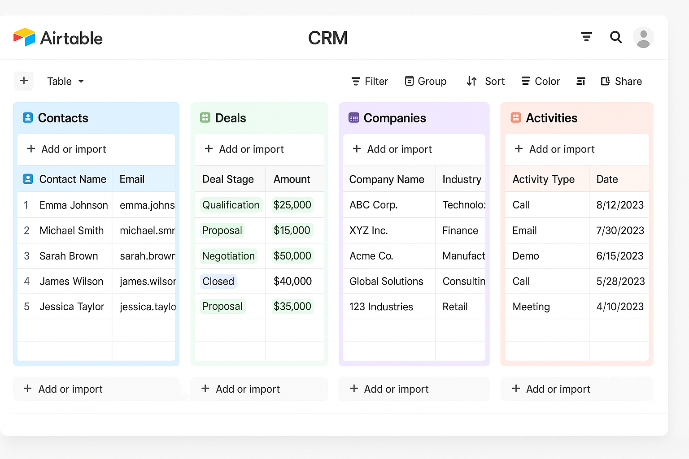

### 7.2.2 Uncovering Firebase's Real-Time Data Strengths

#### 7.2.2.1 Firebase's Cloud Data Model

Firebase takes a different approach with its document-based, cloud-native architecture:

**Firestore Database Structure**:
- **Collections**: Groups of documents (similar to tables)
- **Documents**: Individual records containing fields
- **Subcollections**: Collections nested within documents
- **Fields**: Individual pieces of data within documents

**Flexible Schema**: Documents can have different fields without requiring predefined structure
- One customer document may have a loyalty_tier field
- Another may not, without causing errors
- New fields can be added without database migration

**Hierarchical Organization**: Data can be organized in nested structures
- Users → Orders → Items
- Schools → Classes → Students → Assignments

Sarah explains: "Firebase is like having filing cabinets where each folder can contain different types of documents. My student profiles can have different information based on their grade level or program participation, all stored naturally without forcing everything into the same rigid structure."

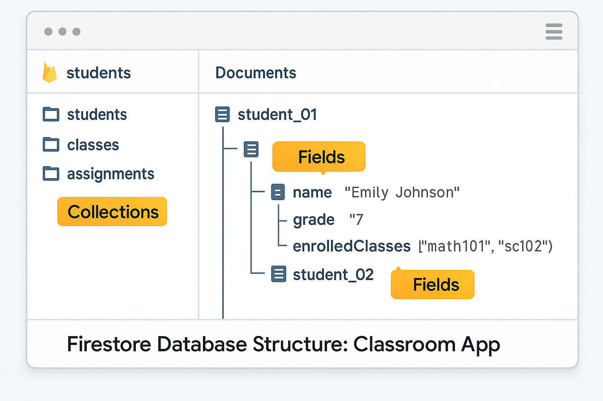
#### 7.2.2.2 Real-time Updates And User Sync

Firebase's standout feature is instant synchronization across all connected devices:

**Real-time Listeners**: Applications automatically update when data changes
- Student sees assignment updates immediately when teacher posts them
- Team members see project changes without refreshing pages
- Customers see real-time inventory availability

**Offline Capability**: Applications work even without internet connection
- Changes are cached locally
- Automatic synchronization when connection returns
- Conflict resolution for simultaneous edits

**Multi-user Collaboration**: Multiple users can work with the same data simultaneously
- Shared documents with live editing
- Chat applications with instant message delivery
- Collaborative project management with real-time updates

Henry's Implementation: "My staff app shows real-time inventory levels. When someone uses ingredients in the kitchen, everyone else immediately sees the updated quantities. No more accidentally starting a recipe when we're low on flour!"

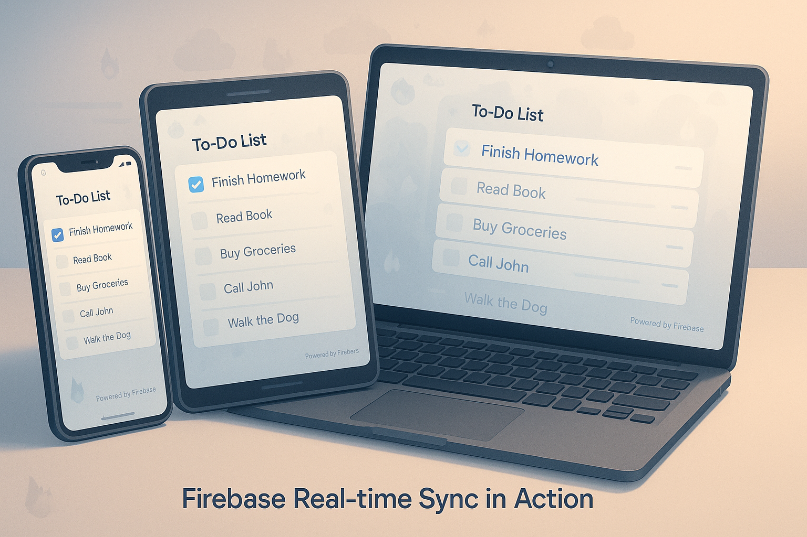

#### 7.2.2.3 Firebase's Backend Features for No-Code Use

Firebase provides comprehensive backend services that traditionally required significant technical expertise:

**Authentication**: User management without complex setup
- Email/password, Google, Facebook login options
- User profile management
- Security rule integration

**Security Rules**: Database access control with intuitive syntax
- Control who can read/write specific data
- User-based permissions
- Time-based access restrictions

**Cloud Functions**: Server-side logic triggered by database events
- Send emails when new users register
- Process payments when orders are created
- Generate reports on schedule

**Hosting**: Web application deployment with global CDN
- Fast content delivery worldwide
- SSL certificates included
- Custom domain support

Sarah notes: "Firebase handles all the technical infrastructure I don't want to worry about. I can focus on creating great educational experiences while Firebase manages user authentication, data security, and app performance."

> **PRO-TIP:**
> Firebase's real-time features are powerful but can increase costs with heavy usage. Consider whether you need real-time updates for all data or just specific features.

### 7.2.3 Using Google Sheets as a Lightweight Data Store

#### 7.2.3.1 Sheets as a Familiar Spreadsheet Tool

Google Sheets serves as an accessible entry point into database concepts:

**Familiar Interface**: Most users already understand spreadsheet basics
- Rows and columns organization
- Formulas and calculations
- Sorting and filtering
- Data validation

**Collaboration Features**: Built-in sharing and teamwork capabilities
- Real-time collaborative editing
- Comment and suggestion systems
- Permission management (view, edit, comment)
- Revision history tracking

**Accessibility**: Available anywhere with internet connection
- Web-based access from any device
- Mobile apps for on-the-go editing
- Offline editing with sync when reconnected
- Integration with Google Workspace ecosystem

Henry reflects: "I started with Google Sheets because it felt comfortable and didn't cost anything extra. Even now that I use more advanced tools, I still use Sheets for quick data collection and simple tracking where I don't need complex relationships."

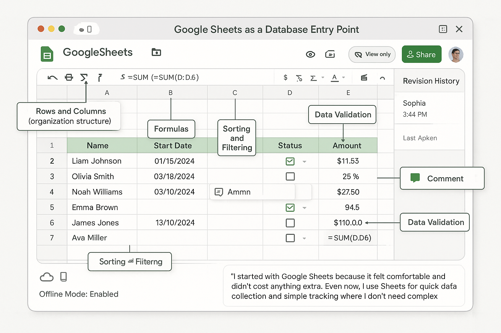

#### 7.2.3.2 Use of Sheets for Small-Scale Databases

Google Sheets works well for straightforward data needs:

**Optimal Use Cases**:
- Contact lists and simple CRM
- Event planning and guest lists
- Budget tracking and expense management
- Survey responses and form data
- Simple inventory tracking
- Project task lists

**Sheet-as-Database Techniques**:
- Use first row for column headers
- Apply data validation for consistency
- Use named ranges for easier formula reference
- Create separate sheets for different data types
- Implement simple lookup formulas for basic relationships

**Limitations to Consider**:
- No true relational capabilities
- Performance issues with very large datasets
- Limited data types compared to dedicated databases
- Concurrent user limitations for heavy editing

Sarah's Current Usage: "I still use Google Sheets for my gradebook because it integrates perfectly with Google Classroom and provides the calculation flexibility I need. For more complex student data relationships, I've moved to Airtable, but Sheets remains perfect for straightforward numerical tracking."

#### 7.2.3.3 Tools that Integrate easily with Sheets (for example, Glide, Zapier)

Google Sheets' greatest strength as a database is its extensive integration ecosystem:

**App Development Platforms**:
- **Glide**: Creates mobile apps directly from Sheets data
- **AppSheet**: Google's own no-code app platform
- **Bubble**: Supports Sheets as a data source
- **Stacker**: Builds web applications from spreadsheet data

**Automation and Workflow Tools**:
- **Zapier**: Triggers actions based on Sheet changes
- **Make (Integromat)**: Complex workflow automation
- **Google Apps Script**: Custom automation within Google ecosystem
- **IFTTT**: Simple trigger-based automation

**Form and Data Collection**:
- **Google Forms**: Direct integration for data collection
- **Typeform**: Advanced form builder with Sheets export
- **JotForm**: Form responses automatically populate Sheets
- **Survey tools**: Most support direct Sheets integration

**Analytics and Reporting**:
- **Google Data Studio**: Creates dashboards from Sheets data
- **Tableau**: Advanced visualization capabilities
- **Power BI**: Microsoft's business intelligence platform
- **Chart.js and other visualization libraries**: For custom dashboards

Henry's Integration Strategy: "My Google Sheet serves as the central hub. Zapier moves data from my website forms into Sheets, Glide creates a mobile app for my staff from the same data, and Data Studio creates executive dashboards for me. It's like having one source of truth that powers multiple applications."

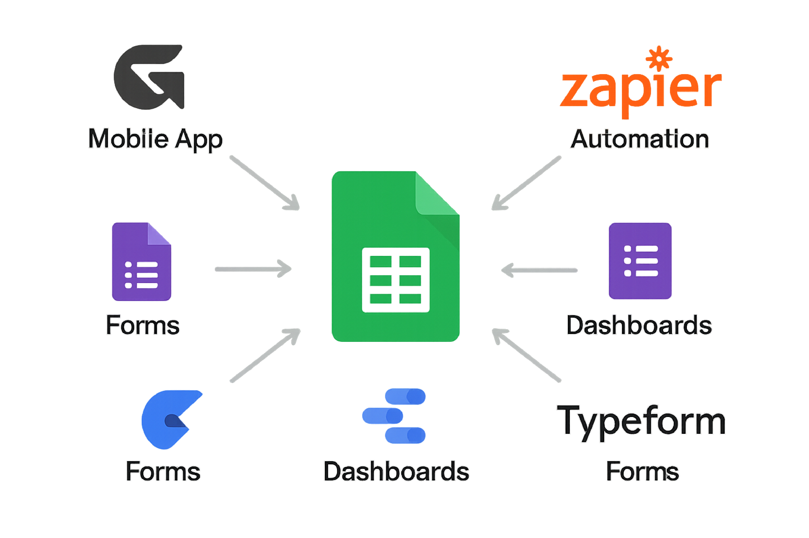

✨ **PLAYGROUND TASK #2: CHOOSE YOUR DATABASE TOOL**

Instructions:
1. Consider a specific project where you need to manage data (examples: event planning, customer management, content creation, student tracking)
2. Evaluate your needs against each tool:
   - Google Sheets: Simple, familiar, free, integrates well
   - Airtable: Relational power, multiple views, great for connected data
   - Firebase: Real-time sync, user authentication, mobile-friendly
3. Create a simple pros/cons list for each tool for your specific project
4. Make your selection and briefly explain your reasoning

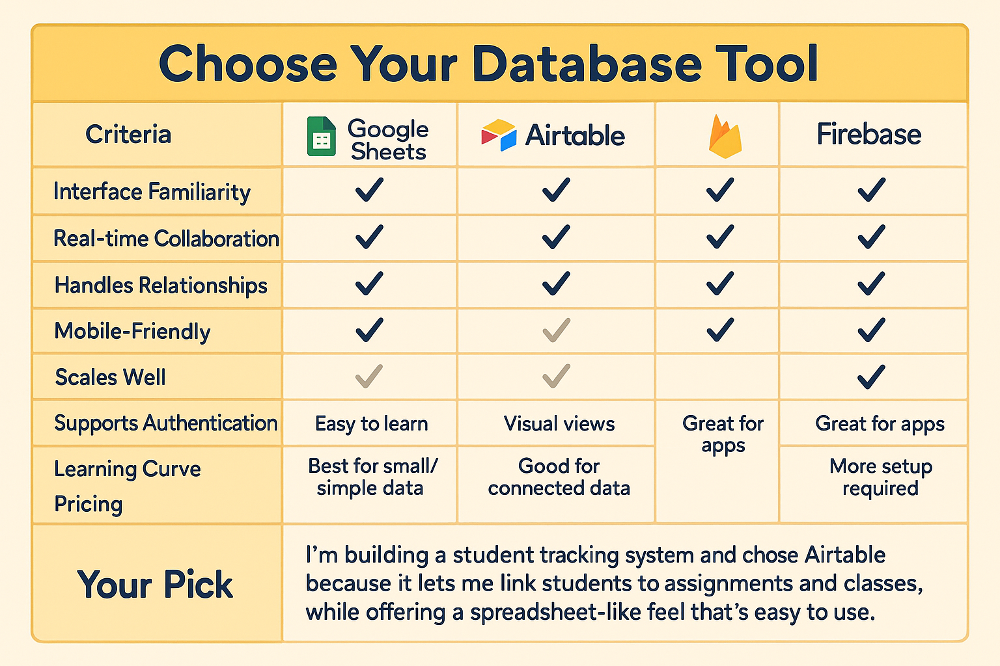

## 7.3 Exploring Data Tools and Their Capabilities

### 7.3.1 Scalability Across Platforms

#### 7.3.1.1 Data Scalability across Different No-Code Tools

Understanding how each platform handles growth helps you plan for the future:

**Google Sheets Scaling Characteristics**:
- **Record Limits**: 10 million cells per spreadsheet (approx. 400,000 rows with 25 columns)
- **Performance**: Noticeable slowdown after 50,000-100,000 rows
- **Concurrent Users**: Up to 100 simultaneous editors, but performance degrades with heavy usage
- **Formula Complexity**: Complex calculations become slow with large datasets

**Airtable Scaling Characteristics**:
- **Record Limits**: 50,000 records per base on Pro plan, 125,000 on Enterprise
- **Performance**: Optimized for database operations, handles complex relationships well
- **Concurrent Users**: Designed for team collaboration without significant performance impact
- **View Performance**: Multiple views and filtering maintain good performance

**Firebase Scaling Characteristics**:
- **Record Limits**: Effectively unlimited (1 million concurrent connections)
- **Performance**: Designed for high-scale applications with automatic optimization
- **Global Distribution**: Data centers worldwide for optimal performance
- **Real-time Performance**: Maintains speed even with thousands of concurrent users

Henry's Scaling Experience: "I started with Google Sheets for 200 customers and it worked great. At 2,000 customers, I noticed slowdowns. Now with Airtable, I handle 5,000+ customers easily, and I know I can grow much larger without performance issues."

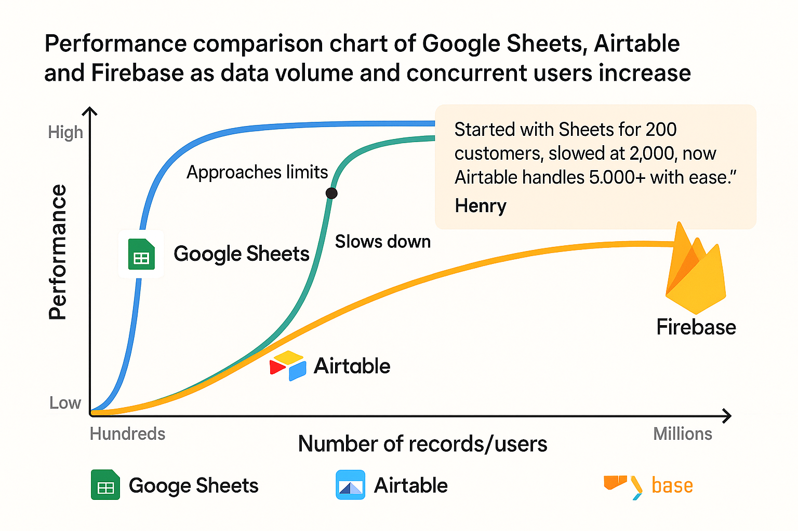

#### 7.3.1.2 Data Size and Record Limits in Free and Paid Plans

Understanding plan limitations helps with budgeting and planning:

**Google Sheets Pricing Tiers**:
- **Free**: 15GB total Google account storage, unlimited sheets
- **Google One Plans**: Additional storage shared across Google services
- **Google Workspace**: Business plans with admin controls and compliance features

**Airtable Pricing Tiers**:
- **Free**: 1,200 records per base, unlimited bases
- **Plus ($10/user/month)**: 5,000 records per base, calendar sync, timeline view
- **Pro ($20/user/month)**: 50,000 records per base, advanced features
- **Enterprise**: 125,000+ records, advanced admin and compliance features

**Firebase Pricing Tiers**:
- **Spark (Free)**: 1GB storage, 10GB transfer, 50,000 reads/day, 20,000 writes/day
- **Blaze (Pay-as-you-go)**: $0.18/GB storage, $0.12/GB transfer, $0.36/million reads
- **Predictable Costs**: Usage-based pricing with monitoring and alerts

Sarah's Budget Planning: "I started with free tiers to test my concepts. As my classroom apps grew popular, I upgraded Airtable to Pro for more records and Firebase to Blaze for real-time features. The predictable monthly costs help me budget for technology expenses."

> **PRO-TIP:**
> Start with free tiers to validate your concept, then upgrade based on actual usage patterns rather than theoretical needs. Most platforms provide usage analytics to help you plan upgrades strategically.

#### 7.3.1.3 Performance Impact for Large Projects

Large-scale projects require different considerations for each platform:

**Optimization Strategies for Google Sheets**:
- Split large datasets across multiple sheets
- Use QUERY function instead of complex nested formulas
- Minimize volatile functions (NOW(), RAND(), etc.)
- Use data validation instead of dependent dropdowns for better performance

**Optimization Strategies for Airtable**:
- Organize data into logical bases to avoid hitting record limits
- Use views and filters efficiently to show only needed data
- Minimize complex rollup and lookup fields when possible
- Archive old records to maintain performance

**Optimization Strategies for Firebase**:
- Structure data to minimize deep queries
- Use indexes for frequently queried fields
- Implement pagination for large result sets
- Consider data denormalization for frequently accessed combinations

Henry's Large Project Approach: "My catering business required tracking complex events with multiple products, staff assignments, and timeline dependencies. I moved from Sheets to Airtable, then implemented Firebase for the mobile coordination app my staff uses during events. Each platform handles the parts it's best at."

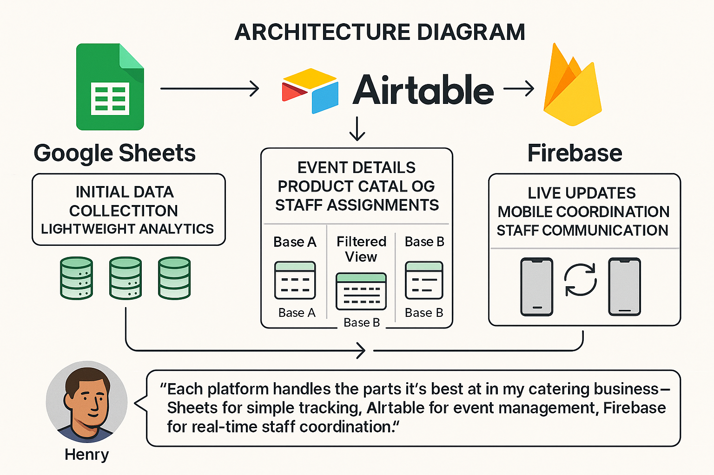

### 7.3.2 Differentiating Real-Time Features

#### 7.3.2.1 Real-time synchronization in Airtable, Firebase, and Google Sheets

Understanding real-time capabilities helps you choose the right tool for collaborative needs:

**Google Sheets Real-time Features**:
- **Collaborative Editing**: Multiple users can edit simultaneously with live cursors
- **Change Notifications**: See edits as they happen
- **Conflict Resolution**: Automatic handling of simultaneous edits to same cell
- **Limitations**: Real-time limited to direct editing, not app integrations

**Airtable Real-time Features**:
- **Live Updates**: Changes appear immediately for all users viewing the same base
- **Collaborative Comments**: Real-time discussion threads on records
- **Block Updates**: Real-time dashboard and visualization updates
- **API Limitations**: External apps may have slight delays accessing updated data

**Firebase Real-time Features**:
- **Instant Synchronization**: Sub-second updates across all connected devices
- **Offline Capability**: Local changes sync when connection restored
- **Real-time Listeners**: Apps automatically update when data changes
- **Global Performance**: Consistent real-time performance worldwide

Sarah compares: "Google Sheets is perfect for my gradebook where I need to see student work in real-time during virtual classes. Airtable keeps my lesson planning synchronized across devices with reasonable speed. For my classroom collaboration app where students submit answers during live discussions, Firebase's instant updates are essential."

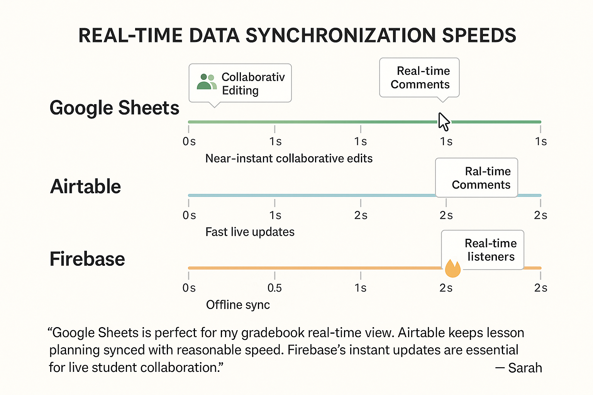

#### 7.3.2.2 Latency and Update Speed

Real-world performance varies based on several factors:

**Factors Affecting Update Speed**:
- Geographic distance from servers
- Internet connection quality and stability
- Data complexity and size of updates
- Number of concurrent users
- Device processing capabilities

**Typical Performance Expectations**:
- **Google Sheets**: 1-3 seconds for collaborative editing
- **Airtable**: 2-5 seconds for complex base updates
- **Firebase**: 100-500 milliseconds for real-time listeners

**Performance Optimization Tips**:
- Choose server regions closest to your users
- Minimize data transferred in each update
- Use efficient query patterns
- Implement local caching where appropriate
- Monitor performance and optimize bottlenecks

Henry's Real-World Experience: "During busy Saturday mornings, my staff needs instant inventory updates. Firebase delivers the speed we need, while Airtable handles our detailed customer relationship management where slight delays don't impact the customer experience."

#### 7.3.2.3 User Experience Impact in Mobile/Web Apps

Real-time performance directly affects user satisfaction:

**High Real-time Requirements**:
- Chat and messaging applications
- Collaborative editing tools
- Live polling and voting systems
- Real-time gaming or interactive content
- Crisis management and emergency response

**Moderate Real-time Requirements**:
- Project management and task tracking
- Inventory and booking systems
- Social media and content sharing
- Learning management systems

**Low Real-time Requirements**:
- Content management systems
- Customer relationship management
- Reporting and analytics dashboards
- Archive and reference systems

Sarah's User Experience Focus: "My students expect immediate feedback when they submit quiz answers during class. Firebase provides that instant gratification. For homework submissions that I'll review later, Airtable's slightly slower updates are perfectly acceptable and more cost-effective."

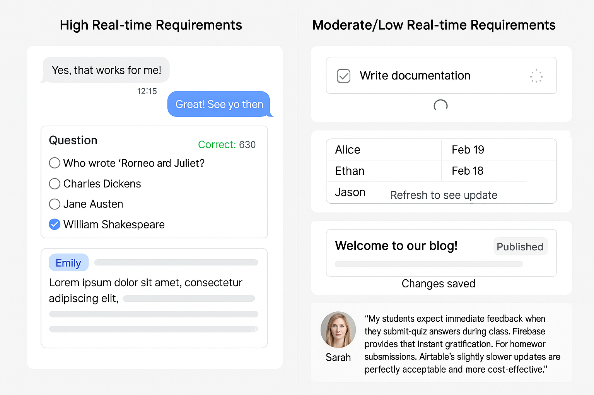

### 7.3.3 Evaluating Ease of Integration with No-Code Tools

#### 7.3.3.1 No-Code Tools Supported by Each Platform

The integration ecosystem varies significantly between platforms:

**Google Sheets Integration Ecosystem**:
- **Native Google Tools**: Forms, Data Studio, Apps Script, Workspace apps
- **Popular No-Code Platforms**: Glide, AppSheet, Bubble, Webflow, Zapier
- **Business Tools**: Most CRM, email marketing, and project management tools
- **Developer-Friendly**: Extensive API and Google Apps Script capabilities

**Airtable Integration Ecosystem**:
- **Native Features**: Forms, automation, sync with external databases
- **No-Code Platforms**: Bubble, Webflow, Zapier, Make, Stacker
- **Business Tools**: Slack, Microsoft Teams, Salesforce, HubSpot
- **Developer Options**: REST API, webhooks, custom app development

**Firebase Integration Ecosystem**:
- **Google Cloud Services**: Analytics, ML Kit, Cloud Functions, BigQuery
- **Mobile Development**: Flutter, React Native, iOS, Android SDKs
- **Web Development**: React, Angular, Vue.js libraries
- **Limited No-Code**: Fewer direct no-code integrations, more developer focused

Henry notes: "Google Sheets connects to almost everything I use for my small business. Airtable provides more sophisticated database features while still connecting to most of my tools. Firebase is powerful but requires more technical integration—though the results are worth it for my real-time applications."

#### 7.3.3.2 Data Connection Methods (APIs, Native Integration, Plugins)

Each platform offers different ways to connect with other applications:

**Google Sheets Connection Methods**:
- **Native Integration**: Direct connections within Google Workspace ecosystem
- **Add-ons**: Third-party extensions available from Google Workspace Marketplace
- **API Access**: Google Sheets API for custom integrations
- **Zapier/Make**: Extensive pre-built automation connections
- **Import/Export**: CSV, Excel, and other format support

**Airtable Connection Methods**:
- **Native Integrations**: Built-in connections to popular business tools
- **Airtable Sync**: Two-way synchronization with external databases
- **REST API**: Comprehensive API for custom development
- **Webhooks**: Real-time notifications when data changes
- **Zapier/Make**: Rich automation capabilities with hundreds of apps

**Firebase Connection Methods**:
- **SDKs**: Native libraries for web and mobile development
- **REST API**: Standard HTTP-based data access
- **Admin SDKs**: Server-side integration capabilities
- **Extensions**: Pre-built integrations for common services
- **Cloud Functions**: Custom server-side logic for complex integrations

Sarah explains her connection strategy: "I use Google Sheets with Zapier for simple data flow from forms to my gradebook. Airtable's native Slack integration keeps my teaching team updated on lesson planning changes. For my student collaboration app, Firebase's JavaScript SDK provides the seamless real-time experience students expect."


#### 7.3.3.3 Categorizing Tools by Ease of Connection and Automation

Understanding connection complexity helps you plan integration strategies:

**Easy Connections (Plug-and-Play)**:
- Google Sheets ↔ Glide, AppSheet, Google Forms
- Airtable ↔ Zapier, Stacker, most form builders
- All platforms ↔ Basic automation tools

**Moderate Connections (Some Configuration)**:
- Google Sheets ↔ Bubble, advanced Zapier workflows
- Airtable ↔ Custom web apps, complex automation
- Firebase ↔ No-code builders with API connectors

**Advanced Connections (Technical Setup)**:
- Custom API integrations for all platforms
- Firebase ↔ Most no-code platforms (requires API knowledge)
- Complex multi-platform data synchronization

**Connection Complexity Factors**:
- Authentication requirements
- Data mapping complexity
- Real-time vs. batch processing needs
- Error handling and retry logic
- Rate limiting and usage constraints

Henry's Integration Evolution: "I started with easy Google Sheets connections to get my bakery systems working quickly. As my needs grew more sophisticated, I learned to work with Airtable's API for custom integrations. Firebase required the most technical learning, but now I can build exactly the real-time features my business needs."

> **PRO-TIP:**
> Start with the easiest connections to prove your concept, then gradually tackle more complex integrations as your confidence and skills grow. Many successful no-code projects use a mix of simple and advanced connections based on specific requirements.

✨ **PLAYGROUND TASK #3: PLAN YOUR INTEGRATION STRATEGY**

Instructions:
1. Choose a specific no-code application you want to build (e.g., event management, customer tracking, content planning)
2. List the external tools and services you need to connect (forms, email, calendar, etc.)
3. For each connection, categorize it as Easy, Moderate, or Advanced based on the information above
4. Create a phased implementation plan starting with Easy connections and building toward more complex ones
5. Identify which database platform would support the most connections with the least complexity


## 7.4 Outlining Steps to Design and Connect Databases

### 7.4.1 Designing a Database Schema in Airtable

#### 7.4.1.1 Tables, Fields, and Relationships

Creating an effective Airtable database starts with understanding the core components:

**Tables**: Represent different types of entities in your system
- Think of each table as a category of information
- Examples: Customers, Orders, Products, Events, Students, Assignments

**Fields**: Individual pieces of information about each record
- Choose appropriate field types for your data
- Examples: Text, Number, Date, Attachment, Single/Multiple Select

**Relationships**: Connections between records in different tables
- Link related information together
- Enable powerful data lookups and calculations

Henry's Bakery Schema Planning:
"I need to track customers, their orders, and my products. Each customer can have multiple orders, and each order can contain multiple products. This means I need three tables with specific relationships between them."

**Field Type Selection Guidelines**:
- **Single Line Text**: Names, addresses, simple descriptions
- **Long Text**: Detailed descriptions, notes, instructions
- **Attachment**: Images, documents, files
- **Checkbox**: Yes/No, True/False, completed/incomplete
- **Single Select**: Categories, status levels, priority ratings
- **Multiple Select**: Tags, skills, features that can have multiple values
- **Date**: Deadlines, events, timestamps
- **Number**: Quantities, scores, measurements
- **Currency**: Prices, costs, budgets
- **Percent**: Completion rates, success ratios
- **Email**: Contact information
- **Phone**: Contact numbers
- **URL**: Website links, references


#### 7.4.1.2 Organizing a Sample Project with Multiple Linked Tables

Let's build a complete project step-by-step:

**Sarah's Reading Program Database Structure**:

**Table 1: Students**
- Student Name (Single Line Text)
- Grade Level (Single Select: 6th, 7th, 8th)
- Reading Level (Single Select: Below, At, Above Grade Level)
- Parent Email (Email)
- Active (Checkbox)
- Assignments (Link to Assignments table)

**Table 2: Books**
- Book Title (Single Line Text)
- Author (Single Line Text)
- Reading Level (Single Select: matches Student reading levels)
- Genre (Multiple Select: Fiction, Non-fiction, Mystery, etc.)
- Available Copies (Number)
- Cover Image (Attachment)
- Assigned To (Link to Assignments table)

**Table 3: Assignments**
- Assignment Name (Single Line Text)
- Student (Link to Students table)
- Book (Link to Books table)
- Date Assigned (Date)
- Due Date (Date)
- Status (Single Select: Not Started, In Progress, Submitted, Graded)
- Grade (Number)
- Notes (Long Text)

**Relationship Logic**:
- One student can have many assignments (One-to-Many)
- One book can be assigned to many students (One-to-Many)
- Each assignment connects one student to one book (Many-to-Many through junction table)

**Lookup Fields for Enhanced Functionality**:
- In Assignments table: Student Grade Level (lookup from Students)
- In Assignments table: Book Author (lookup from Books)
- In Students table: Number of Assignments (count from Assignments)
- In Books table: Times Assigned (count from Assignments)


#### 7.4.1.3 Data Types and Views for Better App Usability

Choosing the right views enhances how you work with your data:

**Grid View**: Standard spreadsheet-like interface
- Best for: Data entry, bulk editing, detailed analysis
- Use when: You need to see many fields at once

**Calendar View**: Visual timeline of date-based records
- Best for: Scheduling, deadline tracking, event planning
- Use when: Dates and timing are crucial to your workflow

**Gallery View**: Visual display emphasizing images or attachments
- Best for: Product catalogs, portfolios, visual content
- Use when: Images are a primary component of your records

**Kanban View**: Board-style organization by status or category
- Best for: Project management, workflow tracking, process stages
- Use when: You need to move items through different states

**Form View**: Clean interface for data collection
- Best for: Gathering information from others, surveys, intake forms
- Use when: You need people to submit information easily

Sarah's View Strategy:
- **Grid View**: For detailed grade entry and data management
- **Calendar View**: To see assignment due dates and plan workload
- **Kanban View**: To track assignment progress by status
- **Form View**: For students to submit assignment reflections

Henry's Product Management Views:
- **Grid View**: For inventory management and cost tracking
- **Gallery View**: For visual product catalog with photos
- **Calendar View**: For seasonal product planning and launch dates
- **Form View**: For staff to report ingredient usage

> **PRO-TIP:**
> Create different views for different users and use cases. Your data entry view might be different from your analysis view or your public-facing view. Airtable allows unlimited views per table.

### 7.4.2 Structuring Data in Firebase for App Use

#### 7.4.2.1 Creating a Basic Database using Firebase Console

Getting started with Firebase involves several setup steps:

**Step 1: Create Firebase Project**
1. Go to Firebase Console (console.firebase.google.com)
2. Click "Create a project"
3. Choose project name and settings
4. Enable Google Analytics if desired

**Step 2: Set up Firestore Database**
1. Navigate to Firestore Database in sidebar
2. Click "Create database"
3. Choose security rules (start in test mode for development)
4. Select database location (choose closest to your users)

**Step 3: Understand the Firebase Console Interface**
- **Data Tab**: View and edit your database content
- **Rules Tab**: Configure security and access permissions
- **Indexes Tab**: Optimize query performance
- **Usage Tab**: Monitor database activity and costs

Sarah's Firebase Setup Process: "I created a project called 'Classroom-Collaboration' and set up Firestore in test mode initially. This let me experiment with data structure before implementing proper security rules for student access."


#### 7.4.2.2 Organizing Collections, Documents, and Fields

Firebase uses a different organizational structure than traditional databases:

**Collections**: Groups of documents (like tables, but more flexible)
- Collections don't enforce structure—each document can have different fields
- Collection names should be descriptive and plural (users, posts, orders)
- Collections can contain subcollections for hierarchical organization

**Documents**: Individual records within collections
- Documents are identified by unique IDs (auto-generated or custom)
- Can contain various data types: strings, numbers, booleans, arrays, maps
- Maximum size: 1MB per document

**Fields**: Individual data points within documents
- Flexible typing—different documents can have different field types
- Support for nested objects and arrays
- No predefined schema required

**Subcollections**: Collections nested within documents
- Useful for one-to-many relationships
- Example: users/{userId}/orders/{orderId}
- Enable hierarchical data organization

Henry's Firebase Structure for Real-time Kitchen Coordination:

```
/bakery-operations (root)
  /orders (collection)
    /order_001 (document)
      - customer_name: "John Smith"
      - items: ["chocolate cake", "dozen cookies"]
      - status: "in_progress"
      - priority: "high"
      - timestamp: [Firestore timestamp]
      
  /inventory (collection)
    /flour (document)
      - current_amount: 25
      - unit: "pounds"
      - reorder_level: 10
      - last_updated: [Firestore timestamp]
      
  /staff (collection)
    /baker_01 (document)
      - name: "Maria"
      - current_task: "mixing"
      - availability: true
```

**Data Modeling Best Practices**:
- Keep frequently accessed data together in the same document
- Use subcollections for one-to-many relationships
- Denormalize data to reduce query complexity
- Consider query patterns when designing structure
- Plan for real-time listener efficiency


#### 7.4.2.3 Rules and Permissions for Basic User Security

Firebase Security Rules provide fine-grained access control:

**Rule Structure Basics**:
```javascript
rules_version = '2';
service cloud.firestore {
  match /databases/{database}/documents {
    // Rules go here
  }
}
```

**Common Rule Patterns**:

**Public Read, No Write** (for reference data):
```javascript
match /products/{product} {
  allow read: if true;
  allow write: if false;
}
```

**User-specific Data** (users can only access their own data):
```javascript
match /users/{userId} {
  allow read, write: if request.auth != null && request.auth.uid == userId;
}
```

**Role-based Access** (different permissions for different user types):
```javascript
match /orders/{order} {
  allow read: if request.auth != null;
  allow write: if request.auth != null && 
    (resource.data.customer_id == request.auth.uid || 
     get(/databases/$(database)/documents/users/$(request.auth.uid)).data.role == 'admin');
}
```

Sarah's Classroom Security Rules:
- Students can read assignments and submit responses
- Teachers can create, read, and modify all classroom data
- Parents can view their child's progress but not other students' data
- Public can access general classroom information but not student details

> **PRO-TIP:**
> Start with restrictive security rules and gradually open access as needed. It's easier to loosen security than to fix breaches caused by overly permissive rules.

### 7.4.3 Connecting No-Code Applications to Databases

#### 7.4.3.1 Using Glide to Link with Google Sheets

Glide transforms Google Sheets into mobile apps with minimal configuration:

**Step 1: Prepare Your Google Sheet**
- Organize data with clear column headers in row 1
- Use consistent data formats within each column
- Include image URLs for visual elements
- Set appropriate sharing permissions

**Step 2: Create Glide App**
1. Go to Glide Apps (glideapps.com)
2. Click "New App" and select "Google Sheets"
3. Connect your Google account and select your sheet
4. Choose app template or start from scratch

**Step 3: Configure App Structure**
- **Tabs**: Different sections of your app based on sheet tabs
- **Lists**: Display rows of data from your sheet
- **Details**: Individual record views with all field information
- **Forms**: Allow users to add new rows to your sheet

**Step 4: Customize User Interface**
- Choose display styles for different data types
- Set up filters and search functionality
- Configure user permissions and access levels
- Test on mobile devices for user experience

Henry's Staff Management App with Glide:
"I created a Google Sheet with employee schedules, task assignments, and contact information. Glide turned this into a mobile app my staff uses to check their schedules, mark tasks complete, and communicate shift changes. Updates in the app instantly appear in my master spreadsheet."

**Glide-Specific Features**:
- **Computed Columns**: Perform calculations without complex formulas
- **Relations**: Connect data between different sheets
- **User Profiles**: Personalized experiences based on login
- **Push Notifications**: Alert users to important updates


#### 7.4.3.2 Using Bubble to Connect with Airtable APIs

Bubble's visual programming environment can integrate with Airtable's powerful API:

**Step 1: Set up Airtable API Access**
1. In Airtable, go to Help > API Documentation
2. Select your base to get specific API instructions
3. Generate API key from Account > API section
4. Note your Base ID and Table names

**Step 2: Configure Bubble API Connector**
1. In Bubble, go to Plugins and install API Connector
2. Add new API connection
3. Configure authentication with Airtable API key
4. Set up API calls for different operations (GET, POST, PATCH, DELETE)

**Step 3: Create Data Types in Bubble**
- Define fields that match your Airtable structure
- Set up appropriate field types (text, number, date, etc.)
- Configure relationships between different data types

**Step 4: Build Workflows**
- **Display Data**: Use API calls to show Airtable records in Bubble
- **Create Records**: Form submissions that create new Airtable entries
- **Update Records**: Allow users to modify existing information
- **Delete Records**: Remove data with appropriate permissions

Sarah's Lesson Planning Web App:
"I use Airtable to organize my lesson plans with linked standards, resources, and assessments. My Bubble web app pulls this data to create a beautiful, searchable interface for browsing lessons, while also allowing me to mark lessons as completed and add reflection notes that sync back to Airtable."

**API Integration Best Practices**:
- Cache frequently accessed data to reduce API calls
- Implement error handling for network issues
- Use pagination for large datasets
- Monitor API usage to stay within rate limits
- Secure API keys and never expose them in client-side code


#### 7.4.3.3 Utilizing Firebase with No-Code Builders via Plugins or API Connectors

Firebase integration with no-code platforms requires more technical setup but provides powerful real-time capabilities:

**Integration Methods**:

**Method 1: Direct SDK Integration** (for platforms that support it)
- Some advanced no-code platforms allow Firebase SDK installation
- Provides full real-time capabilities and offline support
- Requires understanding of Firebase concepts and security rules

**Method 2: REST API Integration**
- Use Firebase's REST API for basic CRUD operations
- Limited real-time capabilities compared to SDK
- Easier to implement in most no-code platforms

**Method 3: Third-party Connectors**
- Zapier, Make, and other automation tools provide Firebase connections
- Good for triggering actions based on Firebase data changes
- Limited to specific use cases and may have latency

**Setting up Firebase REST API in No-Code Platforms**:

1. **Get Firebase Project Config**:
   - Project ID, API Key, Auth Domain from Firebase console

2. **Configure Authentication**:
   - Set up user authentication flow
   - Manage authentication tokens

3. **Set up CRUD Operations**:
   - GET: Retrieve data from collections
   - POST: Create new documents
   - PATCH: Update existing documents
   - DELETE: Remove documents

Henry's Real-time Kitchen Dashboard:
"I use a no-code dashboard builder connected to Firebase via REST API. It displays real-time order status, inventory levels, and staff assignments. While not as instant as native Firebase apps, the 2-3 second delay is acceptable for our kitchen coordination needs."

**Firebase Integration Challenges and Solutions**:
- **Authentication Complexity**: Start with simple API key auth, upgrade to user auth later
- **Real-time Limitations**: Use polling or webhooks if real-time isn't available
- **Data Structure**: Plan your Firebase structure to work well with REST API access
- **Cost Management**: Monitor usage and optimize queries to control costs

> **PRO-TIP:**
> Start with simpler database connections (Google Sheets or Airtable) to build your app concept, then migrate to Firebase when you need advanced real-time features or scale beyond other platforms' limits.

### 7.4.4 Creating Data-Driven Features in No-Code Tools

#### 7.4.4.1 Creating Dynamic Pages and Forms based on User Input

Data-driven interfaces adapt to user needs and database content:

**Dynamic Page Generation**:
- **Template Pages**: Single page design that displays different data based on URL parameters
- **Conditional Visibility**: Show/hide elements based on user type, data values, or other conditions
- **Dynamic Lists**: Automatically update as database content changes
- **Personalized Content**: Display information relevant to the specific logged-in user

**Dynamic Form Creation**:
- **Conditional Fields**: Show additional fields based on previous answers
- **Pre-populated Data**: Fill forms with existing information for editing
- **Dynamic Dropdowns**: Options that change based on other selections
- **Validation Rules**: Ensure data quality with context-aware validation

Sarah's Dynamic Student Portal:
"Each student sees a personalized dashboard showing their assignments, progress, and recommended reading. The same page template displays different content based on who's logged in. Assignment forms adapt based on the assignment type—book reports show different fields than creative writing assignments."

**Implementation Strategies**:

**In Glide Apps**:
- Use row owners for personalized content
- Configure visibility conditions on components
- Set up choice components for dynamic options
- Use computed columns for conditional logic

**In Bubble**:
- Create reusable elements with conditional formatting
- Use states and custom states for dynamic behavior
- Set up database queries with dynamic constraints
- Implement user roles and privacy rules

**In Airtable Interfaces**:
- Create different views for different user types
- Use filtering and grouping for personalized experiences
- Set up conditional formatting rules
- Configure record-specific permissions


#### 7.4.4.2 Developing Filtering and Search Functions using Real-time Data

Powerful search and filtering capabilities make large datasets manageable:

**Search Function Types**:
- **Full-text Search**: Search across multiple fields simultaneously
- **Autocomplete**: Suggest matches as users type
- **Fuzzy Search**: Find results even with typos or partial matches
- **Advanced Search**: Multiple criteria with boolean logic

**Filtering Capabilities**:
- **Category Filters**: Dropdown menus for predefined categories
- **Range Filters**: Sliders or inputs for numerical ranges
- **Date Filters**: Calendar pickers for time-based filtering
- **Tag Filters**: Multiple selection for items with multiple categories
- **Real-time Updates**: Filters update immediately as data changes

Henry's Product Catalog Implementation:
"My mobile app lets customers search our entire product catalog by name, ingredient, or dietary restriction. They can filter by price range, availability, and category. As I update inventory in Airtable, the app immediately reflects what's actually available, preventing disappointed customers."

**Technical Implementation**:

**Google Sheets + Glide**:
- Use Glide's built-in search and filter components
- Create choice components for category filtering
- Set up number and date range filters
- Use computed columns for complex filtering logic

**Airtable + Custom Apps**:
- Leverage Airtable's powerful filtering API
- Implement client-side filtering for performance
- Use Airtable's formula fields for complex calculations
- Set up saved filters for common use cases

**Firebase + No-Code Builders**:
- Use Firestore's querying capabilities
- Implement compound queries for multiple filters
- Set up text search with additional search services
- Use real-time listeners for instant updates


#### 7.4.4.3 Creating Dashboards and Reports from Live Datasets

Data visualization transforms raw information into actionable insights:

**Dashboard Components**:
- **Key Performance Indicators (KPIs)**: Important metrics displayed prominently
- **Charts and Graphs**: Visual representation of trends and patterns
- **Summary Tables**: Aggregated data in tabular format
- **Progress Indicators**: Visual progress bars and completion meters
- **Alert Systems**: Notifications when metrics exceed thresholds

**Report Types**:
- **Executive Summaries**: High-level overview for decision makers
- **Operational Reports**: Detailed information for day-to-day management
- **Performance Analytics**: Trend analysis and comparative metrics
- **Exception Reports**: Highlighting items requiring attention

Sarah's Teaching Dashboard:
"My dashboard shows class performance metrics, individual student progress, assignment completion rates, and reading level improvements. I can see which students need additional support and which teaching strategies are most effective. The data updates in real-time as students complete assignments."

**Dashboard Creation Platforms**:

**Google Data Studio** (for Google Sheets data):
- Drag-and-drop chart creation
- Automatic data refresh from connected sheets
- Sharing and collaboration features
- Custom calculations and derived metrics

**Airtable Blocks and Interfaces**:
- Built-in chart and summary blocks
- Custom page layouts for different audiences
- Real-time updates from base data
- Embedded forms and linked records

**Third-party Dashboard Tools**:
- Tableau, Power BI for advanced analytics
- Grafana, Retool for technical dashboards
- Custom no-code dashboard builders
- Integration through APIs or data connectors

Henry's Business Intelligence Dashboard:
"I track daily sales, inventory turnover, customer acquisition, and seasonal trends. My dashboard pulls data from multiple sources—Airtable for customer data, Google Sheets for financial tracking, and my POS system through Zapier. Everything updates automatically, so I always know how my business is performing."

**Dashboard Design Best Practices**:
- **Focus on User Needs**: Design for specific decisions and actions
- **Visual Hierarchy**: Most important information should be most prominent
- **Consistent Updates**: Ensure data freshness and reliability
- **Mobile Responsive**: Dashboards should work on all devices
- **Performance Optimization**: Fast loading times for better user experience


✨ **PLAYGROUND TASK #4: DESIGN YOUR DATABASE SCHEMA**

Instructions:
1. Choose a specific application you want to build (examples: event planning, inventory management, student tracking, customer management)
2. Identify the main entities (types of things) you need to track
3. For each entity, list the specific information (fields) you need to store
4. Identify relationships between entities (what connects to what)
5. Choose your database platform (Google Sheets, Airtable, or Firebase) and justify your choice
6. Sketch a simple schema diagram showing tables/collections and their relationships


## 7.5 Summary

Congratulations! You've now mastered the fundamentals of no-code database management and integration. Let's recap the key concepts and skills you've developed:

### Key Concepts Mastered

**Database Foundation Knowledge**:
- Understanding of structured vs. unstructured data
- Database concepts adapted for no-code environments
- The critical role of data in powering dynamic applications

**Platform Expertise**:
- **Google Sheets**: Leveraging familiar spreadsheet interfaces for simple data management and extensive integrations
- **Airtable**: Harnessing relational database power with user-friendly interfaces and flexible views
- **Firebase**: Implementing real-time, scalable cloud databases for advanced applications

**Integration Capabilities**:
- Connecting databases to no-code applications through various methods
- Understanding API integration basics and implementation strategies
- Choosing appropriate connection methods based on complexity and requirements

**Advanced Features**:
- Creating dynamic, data-driven user interfaces
- Implementing search, filtering, and real-time functionality
- Building dashboards and reports from live datasets

### Henry's Transformation Journey

Henry started this session managing customer information in scattered notes and simple spreadsheets. Now he operates a sophisticated data ecosystem:

- **Customer Relationship Management**: Airtable base connecting customers, orders, and preferences with automated workflows
- **Real-time Kitchen Coordination**: Firebase-powered staff app providing instant inventory updates and task coordination
- **Business Intelligence**: Integrated dashboards showing sales trends, customer insights, and operational metrics
- **Automated Processes**: Data flows seamlessly between his website, CRM, accounting system, and staff applications

"The transformation has been incredible," Henry reflects. "My data used to be scattered across different tools, requiring manual effort to keep everything synchronized. Now my systems talk to each other automatically, giving me a complete picture of my business in real-time."

### Sarah's Educational Innovation

Sarah evolved from manual gradebooks and disparate teaching tools to an integrated educational technology ecosystem:

- **Student Information System**: Comprehensive tracking of student progress, preferences, and performance across multiple subjects
- **Dynamic Learning Platforms**: Personalized student experiences that adapt based on individual learning data
- **Collaborative Tools**: Real-time applications enabling seamless student-teacher and peer-to-peer interaction
- **Data-Driven Instruction**: Analytics and reporting that inform teaching strategies and identify students needing additional support

"What excites me most," Sarah explains, "is how data-driven tools help me personalize education for each student. I can see learning patterns I never noticed before and provide targeted support exactly when students need it."

### Looking Forward: Your Data-Driven Future

As you apply these database management skills to your own projects, remember these essential principles:

**Start Simple, Scale Smart**: Begin with the simplest database solution that meets your immediate needs, then evolve to more sophisticated platforms as your requirements grow.

**Integration Planning**: Consider how your database will connect with other tools from the beginning. The right integration strategy can save significant time and complexity later.

**User Experience Focus**: Design your data structure and interfaces with end users in mind. The most powerful database is useless if people can't easily access and update the information they need.

**Security and Privacy**: Implement appropriate security measures from the start, especially when handling sensitive information. It's much easier to build security in than to add it later.

### Next Steps in Your No-Code Journey

With solid database management skills, you're ready to build sophisticated applications that can:
- Handle complex business logic and workflows
- Provide personalized experiences for different users
- Scale from individual projects to enterprise-level solutions
- Integrate seamlessly with existing tools and systems

Your next learning opportunities might include:
- Advanced automation and workflow optimization
- Mobile app development with complex data relationships
- API development and custom integration creation
- Analytics and business intelligence implementation

### Final Reflection

Database management in the no-code world represents a fundamental shift in how we think about information systems. You no longer need years of technical training to build sophisticated data-driven applications. With the tools and techniques you've learned, you can create solutions that would have required entire development teams just a few years ago.

The key to success lies not in mastering every technical detail, but in understanding your users' needs, designing clean data structures, and choosing the right tools for each specific challenge. As Henry and Sarah have demonstrated, thoughtful application of no-code database principles can transform how you work, learn, and serve others.


---

*Ready to transform your own data management? Start with the Playground Task #4 above, and begin building the database foundation for your next great no-code application!*
