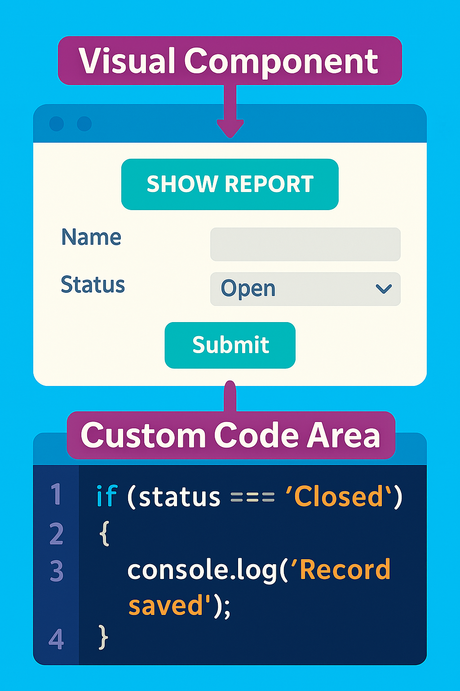

# Module 2 - Session 5: Low-Code Application Development

Welcome back, app innovation enthusiasts!

In our previous sessions, we explored no-code website creation and mobile app development with Glide. Now, we're taking another exciting step forward as we delve into the world of low-code application development. This hybrid approach combines the accessibility of no-code tools with the flexibility of minimal coding to create even more powerful digital solutions!

## Learning Objectives

In this session, you will learn to:
- Define the concept of Low-Code development and distinguish it from No-Code solutions
- Describe practical uses of Low-Code in creating custom solutions
- Navigate PowerApps' interface, utilize its features, and apply customization tools
- Enhance Low-Code apps with Replit and basic Python scripts
- Evaluate and optimize your low-code applications

Let's continue our journey with our dedicated entrepreneurs, Henry (from "The Sweet Spot Bakery") and Sarah Miller (our resourceful middle school English teacher)!


## 5.1 Conceptualizing Low-Code Innovation

### 5.1.1 Low-Code for Applications

Low-code development represents the perfect middle ground between completely visual no-code platforms and traditional programming. Think of it as having training wheels that you can take off when you're ready for more advanced maneuvers.

#### 5.1.1.1 Core Concepts of Low-Code Innovation

While no-code platforms like Glide are fantastic for many applications, low-code platforms offer additional flexibility when you need more customized solutions:

- **Visual Development Environment**: Drag-and-drop interfaces similar to no-code tools
- **Logic Building Blocks**: Pre-built components for common functions 
- **Minimal Coding Areas**: Spaces where you can add small amounts of code for custom functionality
- **Integration Capabilities**: Connect to a wider range of data sources and services

Sarah's Scenario: After using no-code tools for basic classroom management, Sarah wants to create a more sophisticated assessment system that adapts questions based on student performance. This requires some custom logic that goes beyond what pure no-code tools can offer.

Henry's Scenario: Henry's bakery business has grown, and he now needs an inventory management system that connects his point-of-sale system with his supplier ordering process—something that requires more customization than his no-code Glide app can provide.

#### 5.1.1.2 Advantages for Custom Projects

Low-code development offers several key benefits:

- **Reduced Development Time**: 50-90% faster than traditional coding
- **Lower Technical Barrier**: Accessible to those with minimal coding experience
- **Greater Customization**: More flexibility than purely no-code solutions
- **Scalability**: Better equipped to grow with your needs
- **Cost Efficiency**: Requires fewer specialized resources than traditional development



### 5.1.2 Low-Code versus Traditional Coding Methods

#### 5.1.2.1 Simplification Techniques

Low-code platforms simplify development through:

- **Visual Process Modeling**: Design workflows through diagrams rather than code
- **Pre-built Templates**: Start with functional foundations
- **Form Builders**: Create user interfaces without writing front-end code
- **Business Logic Automation**: Define rules and conditions visually
- **Reusable Components**: Leverage existing solutions for common needs

> **PRO-TIP:**
> When deciding between no-code and low-code, ask yourself: "Do I need custom logic that goes beyond 'if this, then that' rules?" If yes, low-code is likely your better option.

#### 5.1.2.2 Impact on DIY Digital Innovation

The rise of low-code tools has democratized software development in remarkable ways:

- **Citizen Developers**: Non-IT professionals can now create professional applications
- **Rapid Prototyping**: Ideas can be tested quickly before significant investment
- **IT Backlog Relief**: Business units can solve some of their own challenges
- **Innovation Acceleration**: More ideas can be brought to reality faster

Sarah reflects: "With my limited coding background from a college course, low-code feels like the perfect middle ground. I can use the visual tools for most features, but add small scripts when I need something more specific for my classroom needs."

[Image Placeholder: Screenshot of a simple low-code interface with arrows pointing to different areas labeled "Visual Component" and "Custom Code Area" to illustrate the hybrid nature of low-code development](./5.3.png)

## 5.2 Exploring PowerApps for App Projects

Microsoft PowerApps is an excellent entry point into low-code development, offering an accessible yet powerful platform for creating business applications.

### 5.2.1 Navigating the PowerApps Interface

#### 5.2.1.1 Intuitive Visual Elements

When you first open PowerApps, you'll find a surprisingly approachable interface:

- **Home Screen**: Access to templates, recent apps, and learning resources
- **Design Canvas**: Where you'll build your app's interface through drag-and-drop
- **Properties Panel**: Configure the details of selected elements
- **Formula Bar**: Add custom expressions and light code
- **Media Panel**: Manage images and other media resources

Henry's First Impression: "It reminds me a bit of Excel with its formulas, but much more visual. I can actually see my bakery inventory app taking shape!"

[Screen Placeholder: PowerApps main interface with labeled components (Design Canvas, Properties Panel, Formula Bar, etc.) and a simple inventory app being built](./5.4.png)

#### 5.2.1.2 Customization Tools for Branding

PowerApps makes it easy to maintain your brand identity:

- **Theme Colors**: Set your primary brand colors for consistent application
- **Custom Icons**: Upload your own graphics for a personalized look
- **Typography Settings**: Choose fonts that match your brand guidelines
- **Layout Templates**: Select from various arrangements to best present your data

> **PRO-TIP:**
> Create a single "Style" screen in your PowerApp where you define all your colors, fonts, and design elements. Then reference these throughout your app. This makes rebranding much easier later!

### 5.2.2 Customizing PowerApps Templates

#### 5.2.2.1 Template Options and Use Cases

PowerApps offers numerous templates to jumpstart your development:

- **Data Collection**: Forms for gathering and storing information
- **Task Management**: Track and assign responsibilities
- **Approval Workflows**: Route items for review and sign-off
- **Inventory Tracking**: Monitor stock levels and movements
- **Service Requests**: Handle customer or internal support needs

Sarah's Template Choice: She starts with the "Survey" template to build her adaptive assessment tool, knowing she'll need to customize it significantly for educational purposes.

Henry's Template Choice: He selects the "Inventory Management" template as his starting point for tracking bakery supplies and ingredients.

[Screen Placeholder: Gallery of PowerApps templates with brief descriptions for each, highlighting the "Survey" and "Inventory Management" templates](./5.5.png)

#### 5.2.2.2 Comparing Flexibility Across Template Designs

Not all templates are created equal when it comes to customization:

- **Basic Templates**: Offer simple functionality but are highly adaptable
- **Complex Templates**: Include more features but may be more difficult to modify
- **Industry-Specific Templates**: Pre-built for certain use cases but may require industry knowledge

> **PRO-TIP:**
> Sometimes it's easier to start with a simpler template and add complexity than to start with a complex template and remove elements. Consider your comfort level with the platform when making your choice.

✨ **PLAYGROUND TASK #1: SELECT YOUR POWERAPP TEMPLATE**

Instructions:
1. Go to make.powerapps.com and explore the template gallery
2. Identify a template that could be adapted for your needs
3. Note 3 elements you would keep and 2 elements you would change
4. Consider what custom logic might be needed beyond the template's capabilities

[Screen Placeholder: PowerApps template gallery screen with an arrow pointing to the filtering options to help users find relevant templates](./5.6.png)

## 5.3 Integrating Everyday Data for Dynamic Applications

The real power of low-code applications comes from connecting them to your existing data sources.

### 5.3.1 Data Connectivity with Simple Sources

PowerApps can connect to a wide range of data sources, from simple spreadsheets to complex databases.

#### 5.3.1.1 Outlining Steps for Excel Integration

Connecting to Excel is often the simplest starting point:

1. **Prepare Your Excel File**: Ensure your data is in a well-structured table format
2. **Store in an Accessible Location**: Save to OneDrive, SharePoint, or other supported storage
3. **Create a Connection**: In PowerApps, add a new data source
4. **Select Excel**: Choose your file and the specific table within it
5. **Verify the Connection**: Confirm your data appears correctly in PowerApps

Henry's Example: He stores his inventory spreadsheet in OneDrive, with columns for Ingredient, Quantity, Unit, Reorder Point, and Supplier.

[Screen Placeholder: Step-by-step screenshot series showing the process of connecting PowerApps to an Excel file, with specific focus on the "Add data source" dialog](./5.7.png)

#### 5.3.1.2 Connection Methods for Cloud-Based Data

Beyond Excel, PowerApps offers connections to numerous cloud services:

- **Microsoft Services**: SharePoint, Dynamics 365, Teams
- **Other Major Platforms**: Google Sheets, Salesforce, Dropbox
- **Databases**: SQL Server, MySQL, PostgreSQL (via connectors)
- **Web Services**: RESTful APIs, Custom Connectors

Sarah's Approach: She connects her PowerApp to both her Google Sheets grade book and Microsoft Forms quizzes to create a centralized view of student performance.

> **PRO-TIP:**
> When connecting to multiple data sources, sketch out your data relationships first. Understanding how information flows between sources will save you significant troubleshooting time later.

### 5.3.2 Data Mapping Techniques

#### 5.3.2.1 Field Mapping Procedures

Once connected to your data, you'll need to map fields to your app's interface elements:

1. **Identify Key Fields**: Determine which data points are essential for your app
2. **Create Display Forms**: Design screens to show individual records
3. **Build Input Forms**: Create interfaces for data entry or editing
4. **Configure Galleries**: Set up lists or grids to browse multiple records
5. **Establish Relationships**: Connect related data across multiple sources

Henry maps his inventory data fields:
- **Gallery Screen**: Shows ingredient names and current quantities
- **Detail Screen**: Displays full information about the selected ingredient
- **Edit Screen**: Allows updating quantities after usage or deliveries

[Screen Placeholder: PowerApps screen showing the gallery, detail, and edit screens for an inventory app with arrows indicating how data flows between them](./5.7.png)

#### 5.3.2.2 Comparing Synchronization Strategies for Dynamic Updates

How your app handles data changes is crucial for reliable operation:

| Strategy | Pros | Cons | Best For |
|----------|------|------|----------|
| **Real-Time Sync** | Immediate updates | Higher resource usage | Critical operations |
| **Scheduled Sync** | Predictable performance | Potential for outdated data | Batch processing |
| **Manual Refresh** | User control | Requires user action | Occasional reference apps |
| **Offline Capability** | Works without connection | Sync conflicts possible | Field applications |

Sarah implements a hybrid approach for her assessment app:
- Student profile data syncs in real-time
- Question banks update on a nightly schedule
- Assessment results can be captured offline and synced when connectivity returns

✨ **PLAYGROUND TASK #2: MAP YOUR DATA FIELDS**

Instructions:
1. Create a simple table (in Excel or Google Sheets) with at least 5 fields relevant to your app idea
2. Sketch (on paper or digitally) how these fields would appear in:
   - A gallery/list view
   - A details view
   - An edit/create form
3. Note any calculated fields you might need that don't exist in your raw data

[Image Placeholder: A sample sketch showing field mapping between a spreadsheet and app screens with annotations explaining the mapping logic](./5.8.png)

## 5.4 Enhancing Personal Apps with Custom Replit Scripting

When you need functionality beyond what PowerApps offers natively, adding small amounts of custom code can unlock significant capabilities.

### 5.4.1 Replit as an Accessible Enhancement Tool

Replit provides a browser-based development environment perfect for creating small scripts and services to enhance your low-code apps.

#### 5.4.1.1 Browser-Based IDE Capabilities

Replit eliminates the need for complex software installation:

- **Multi-Language Support**: Python, JavaScript, and many other languages
- **Integrated Terminal**: Run commands directly in your browser
- **File Management**: Create and organize your project files
- **Version Control**: Track changes to your code
- **Deployment Tools**: Host your scripts online with a public URL

Henry's Reaction: "I was intimidated by coding at first, but Replit makes it feel much more approachable. I can focus on solving my specific problem without worrying about setting up a development environment."

[Screen Placeholder: Replit interface showing a simple Python script being edited, with file browser, editor, and output panels visible](./5.9.png)

#### 5.4.1.2 Collaborative and Solo Scripting Options

Replit offers flexibility in how you work:

- **Solo Development**: Work independently on your enhancements
- **Collaboration Features**: Share your projects with others for help
- **Templates**: Start with pre-built foundations for common use cases
- **Community Resources**: Learn from examples shared by others

Sarah's Approach: She collaborates with a technically-inclined colleague to create a Python script that implements custom scoring algorithms for her adaptive assessments.

> **PRO-TIP:**
> Even if you're new to coding, you can often find examples very similar to what you need on sites like Stack Overflow or GitHub. Start by modifying existing code rather than writing from scratch.

### 5.4.2 Role of Python Functions in Boosting App Capabilities

#### 5.4.2.1 Process of Building Simple APIs

Creating a custom API with Python can be surprisingly straightforward:

1. **Install Flask**: A lightweight web framework for Python
2. **Define Routes**: Specify URLs for different functions
3. **Implement Logic**: Write the code for each function
4. **Handle Data**: Process inputs and return outputs
5. **Deploy**: Make your API accessible to your PowerApp

Here's a simple example of a Python Flask API that Henry might create to calculate ingredient amounts for different batch sizes:

```python
from flask import Flask, request, jsonify

app = Flask(__name__)

@app.route('/calculate-batch', methods=['POST'])
def calculate_batch():
    data = request.json
    
    # Extract data from request
    recipe_name = data.get('recipe')
    desired_batch_size = data.get('batchSize')
    standard_batch_size = data.get('standardSize')
    ingredients = data.get('ingredients', [])
    
    # Calculate scaling factor
    scaling_factor = desired_batch_size / standard_batch_size
    
    # Scale each ingredient
    scaled_ingredients = []
    for ingredient in ingredients:
        scaled_ingredients.append({
            'name': ingredient['name'],
            'amount': round(ingredient['amount'] * scaling_factor, 2),
            'unit': ingredient['unit']
        })
    
    # Return the scaled recipe
    return jsonify({
        'recipe': recipe_name,
        'batchSize': desired_batch_size,
        'ingredients': scaled_ingredients
    })

if __name__ == '__main__':
    app.run(host='0.0.0.0', port=8080)
```

[Screen Placeholder: Replit editor showing the above Python Flask API code with annotations explaining key sections]

#### 5.4.2.2 Connecting PowerApps to Custom Scripts

Once your Python script is deployed in Replit, you can connect it to PowerApps:

1. **Create a Custom Connector**: Define how PowerApps will communicate with your API
2. **Configure Authentication**: Set up any necessary security measures
3. **Define Actions**: Specify what operations your API supports
4. **Test the Connection**: Verify that data flows correctly
5. **Implement in Your App**: Add buttons or automation to call your API

Sarah's Implementation: She creates a Python script that analyzes student response patterns and recommends appropriate follow-up questions, then connects this to her PowerApp through a custom connector.

[Screen Placeholder: PowerApps screen showing a "Custom Connectors" configuration page with a connector being created for a Replit-hosted API](./5.10.png)

✨ **PLAYGROUND TASK #3: SKETCH A SIMPLE PYTHON ENHANCEMENT**

Instructions:
1. Identify one calculation or process in your app idea that might benefit from custom code
2. Write pseudocode (plain English steps) for how this process would work
3. Consider what inputs would be needed and what outputs would be returned
4. If you're feeling adventurous, try implementing a simple version in Replit's Python environment

[Image Placeholder: A side-by-side comparison of pseudocode and actual Python code for a simple function, showing how natural language logic translates to code](./5.11.png)

## 5.5 Evaluating Low-Code Applications

Creating your app is just the beginning—ensuring it works well for users is equally important.

### 5.5.1 App Performance and User Experience

#### 5.5.1.1 User Testing and Feedback Collection

Gathering feedback is crucial for refinement:

- **Guided Testing**: Observe users as they navigate your app
- **Task Completion**: Measure success rates for common actions
- **Feedback Forms**: Collect structured input on usability
- **Analytics**: Track how the app is actually being used
- **Iterative Improvement**: Make changes based on feedback

Henry involves his staff: He asks three bakery employees to test his inventory app, timing how long it takes them to check stock levels and update quantities after daily usage.

[Image Placeholder: A person observing another person using a PowerApp on a tablet, with a notepad nearby for recording observations](./5.12.png)

#### 5.5.1.2 Methods for Performance Assessment

Beyond user feedback, technical performance is important:

- **Response Time**: How quickly does the app react to user input?
- **Data Refresh Speed**: How long does it take to update from data sources?
- **Error Rates**: How often do users encounter issues?
- **Device Compatibility**: Does the app work well across different devices?
- **Network Resilience**: How does the app behave with poor connectivity?

Sarah's Evaluation: She monitors how quickly her assessment app loads questions and calculates scores, particularly when multiple students are using it simultaneously.

> **PRO-TIP:**
> Create a simple "test card" with 5-7 specific tasks for users to complete. Time each task and note any confusion points. This structured approach makes feedback more actionable.

### 5.5.2 Optimizing App Features Through Iterative Development

#### 5.5.2.1 Improvement Strategies

Based on evaluation, focus your improvements:

- **Streamline Workflows**: Reduce steps for common tasks
- **Enhance Visual Clarity**: Make important elements stand out
- **Optimize Data Operations**: Fetch only what's needed, when needed
- **Add Guidance**: Include help text or tooltips for complex features
- **Improve Error Handling**: Provide clear feedback when things go wrong

Henry's Refinements: After testing, he adds barcode scanning to speed up inventory checks and simplifies the reordering process to a single button press.

[Screen Placeholder: Before/After comparison of a PowerApp screen showing UI improvements with annotations explaining the changes](./5.13.png)

#### 5.5.2.2 Applying Iterative Updates and Enhancements

Development is rarely "one and done"—plan for continuous improvement:

1. **Release Cycles**: Establish a regular schedule for updates
2. **Change Documentation**: Keep track of modifications
3. **Feature Prioritization**: Focus on high-impact improvements first
4. **User Communication**: Inform users about new capabilities
5. **Training Updates**: Revise any guidance materials as needed

Sarah's Update Process: She releases updates to her assessment app at the beginning of each grading period, focusing on one major enhancement and several minor improvements each cycle.

✨ **PLAYGROUND TASK #4: CREATE AN EVALUATION PLAN**

Instructions:
1. List 5 specific tasks that would be important for users of your app to complete
2. For each task, identify what would constitute "success" and how you would measure it
3. Create a simple feedback form with 3-5 questions to gather user impressions
4. Outline how you would prioritize potential improvements based on feedback

[Image Placeholder: A sample evaluation plan template with sections for Tasks, Success Metrics, Feedback Questions, and Improvement Prioritization](./5.14.png)

## 5.6 Summary

Congratulations! You've now explored the exciting middle ground between no-code and traditional development. Let's recap what we've covered:

1. **Low-Code Fundamentals**: Understanding the balance between visual development and custom coding
2. **PowerApps Exploration**: Navigating Microsoft's powerful low-code platform
3. **Data Integration**: Connecting your apps to everyday information sources
4. **Custom Enhancements**: Using Replit and Python to add specialized capabilities
5. **Evaluation & Optimization**: Ensuring your apps meet user needs effectively

### Real-World Impact

For Henry: His bakery now has a custom inventory management system that:
- Automatically calculates ingredient needs based on production schedules
- Alerts staff when items reach reorder points
- Generates purchase orders with customized calculations for bulk ordering
- Tracks usage patterns to predict future needs

For Sarah: Her classroom assessment system has evolved to:
- Adapt question difficulty based on student performance
- Generate personalized study guides targeting specific weaknesses
- Provide detailed analytics on concept mastery across the class
- Allow students to track their own progress through interactive dashboards

### Your Next Steps

As you continue your low-code journey:

1. **Start Small**: Begin with a focused app that solves one specific problem well
2. **Experiment with Logic**: Try using the formula capabilities in PowerApps
3. **Explore Integrations**: Connect your app to your existing data sources
4. **Add One Custom Feature**: Implement a simple Python enhancement
5. **Gather Feedback**: Test with actual users and refine based on their experience

### Troubleshooting FAQ

Q: My PowerApp is running slowly when connected to large data sources.
A: Try filtering data at the source rather than in the app, retrieving only the records you need.

Q: I'm getting errors when trying to connect to my Replit API.
A: Check that your Replit project is running, the URL is correct, and any required authentication is properly configured.

Q: Users report different experiences on different devices.
A: Test your app on multiple device types and screen sizes, and consider using responsive design elements.

You now have the knowledge to create sophisticated applications with minimal coding! Remember that low-code development is about finding the right balance between visual development and custom scripting to meet your specific needs.

Happy Building!

## CHECK YOUR PROGRESS

Q1. What is a key characteristic that distinguishes low-code from no-code development?
(a) Low-code platforms require extensive programming knowledge.
(b) Low-code platforms allow for adding custom code when needed while still providing visual development tools.
(c) Low-code platforms are exclusively for professional developers.
(d) Low-code platforms do not connect to external data sources.

Q2. Which of the following is a primary advantage of using PowerApps as a low-code development platform?
(a) It requires no Microsoft account or licenses.
(b) It allows easy integration with common business data sources like Excel and SharePoint.
(c) It automatically generates all needed custom code.
(d) It can only be used by professional developers.

Q3. When connecting PowerApps to Excel data, what is an essential preparation step?
(a) Converting Excel files to PDF format first.
(b) Ensuring data is in a well-structured table format.
(c) Limiting spreadsheets to no more than 10 columns.
(d) Writing macros to enable connectivity.

Q4. How does Replit primarily enhance a low-code development process?
(a) By completely replacing the need for PowerApps.
(b) By providing a browser-based environment for creating custom code enhancements.
(c) By offering pre-built apps that can be used without modification.
(d) By restricting access to unwanted users.

Q5. What is a recommended approach for evaluating a low-code application?
(a) Releasing it to all users immediately without testing.
(b) Having users complete specific tasks and measuring their success and completion time.
(c) Focusing exclusively on technical performance metrics like server response time.
(d) Waiting at least six months before gathering any feedback.

Answers:
(b), (b), (b), (b), (b)

## TRY IT YOURSELF: DESIGN A SIMPLE POWERAPP WITH ONE CUSTOM ENHANCEMENT

Imagine you want to create a PowerApp for tracking personal or professional projects, with a custom Python script to calculate estimated completion dates based on task progress.

Instructions:

1. **App Concept**: Define the main purpose of your Project Tracker app and its key features.
   (Example: A project management app that allows users to create projects, add tasks with deadlines, track completion status, and automatically estimate overall project completion dates based on current progress.)

2. **Data Structure**: Design a simple data structure with at least two related tables (e.g., Projects and Tasks).
   - Table 1 Example: Projects (ID, Name, Description, Start_Date, Deadline, Completion_Percentage)
   - Table 2 Example: Tasks (ID, Project_ID, Task_Name, Assigned_To, Due_Date, Status)

3. **App Screens**: Sketch the layout for at least three screens your app would need.
   - Screen 1 Example: Project List (Gallery of all projects with completion percentage)
   - Screen 2 Example: Project Details (Tasks, progress, deadlines)
   - Screen 3 Example: Add/Edit Task Form

4. **Custom Enhancement**: Describe a simple Python function that would enhance your app's functionality. What would it do? What inputs would it need? What output would it provide?
   (Example: A function that takes current task completion percentages and their weights, then calculates a weighted overall project completion percentage and an estimated completion date based on current progress rate.)

This exercise will help you apply the concepts of low-code development, data integration, custom enhancements, and user experience design discussed in the session. Good luck!
